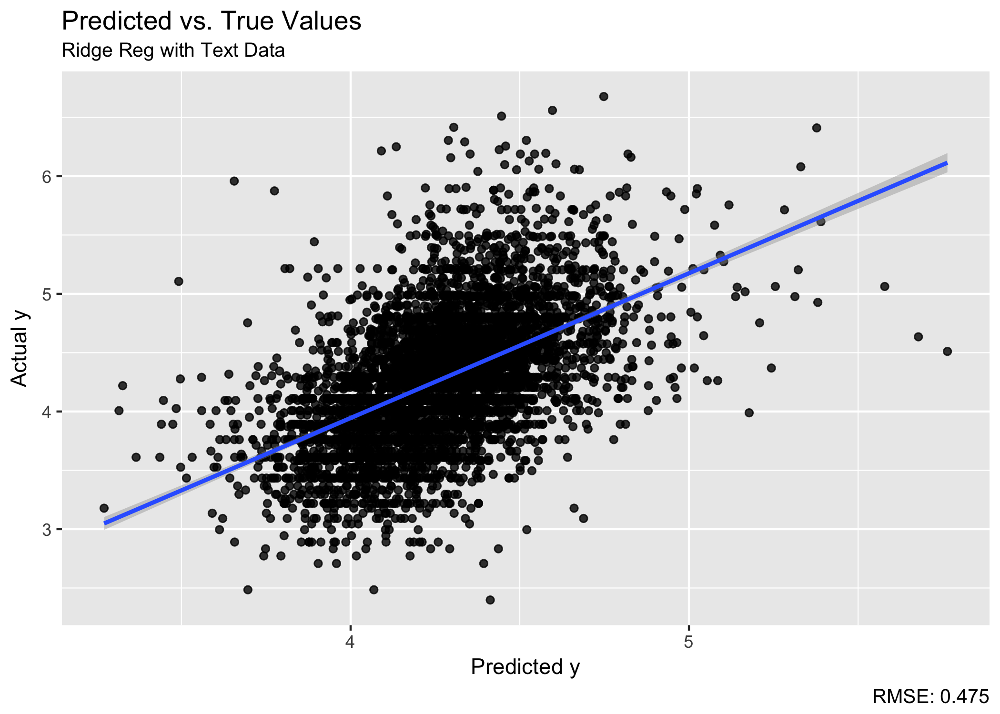
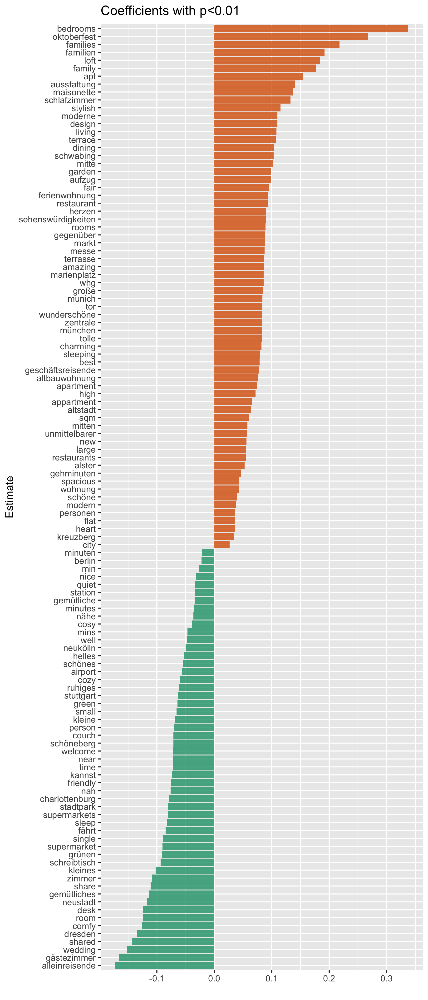

# Structured vs. Text Data to predict Airbnb prices

To get a better understanding about how price-setting in the sharing economy works, a wide range of papers have used a hedonic price model to test the consumer valuation of Airbnb listings (e.g. [Gibbs et al. (2018)](https://www.tandfonline.com/doi/abs/10.1080/10548408.2017.1308292?journalCode=wttm20), [Teubner et al. (2017)](https://www.ceeol.com/search/article-detail?id=596092)). In this kind of modelling, structured attributes (number of rooms, location, rating, etc.) of the listing often together with attributes of the host are used, to evaluate the source of consumer utility. 

In the following analysis I want to exploit the textual data in listing description to predict the price of a listing.

**Research questions**:

1. Can the use of textmining improve the accuracy of predicting the price of Airbnb listings?

2. Which keywords affect the price of a listing either positively or negatively? 
  
**Method**:

To compare my approach with the conventional methods, I first estimate a model in which I use the structured attributes as exogenous regressors to predict the price of an Airbnb listing. Afterwards, I use textual features of the same listings to predict the prices and compare the two models.

The project is divided into three parts:

1. [Part 1:](https://franziloew.github.io/airbnb_textmining/data_prep.html) Data description and preparations. 

2. [Part 2:](https://franziloew.github.io/airbnb_textmining/linreg.html) Linear Regression using structured attributes.

3. [Part 3:](https://franziloew.github.io/airbnb_textmining/linreg_text.html) Linear Regression, Ridge Regression and LASSO using textdata.

**Results**:

1. Based on the RMSE (root mean squared error), the Linear Regression using structured attributes performs best. 

2. From the Linear Regression Model we get the following result:

