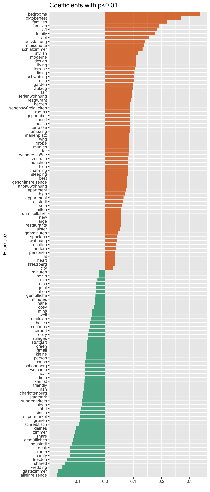
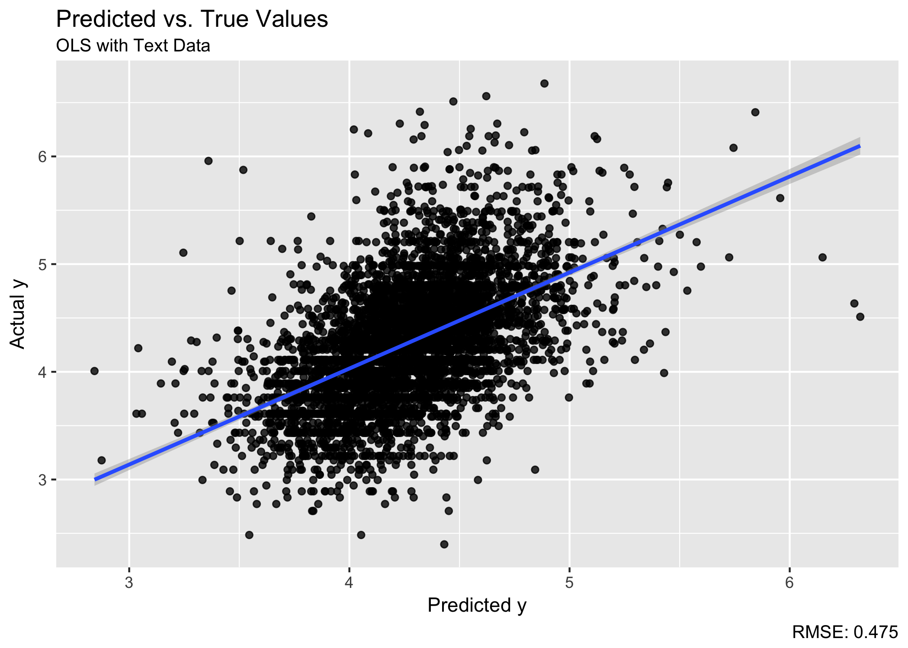
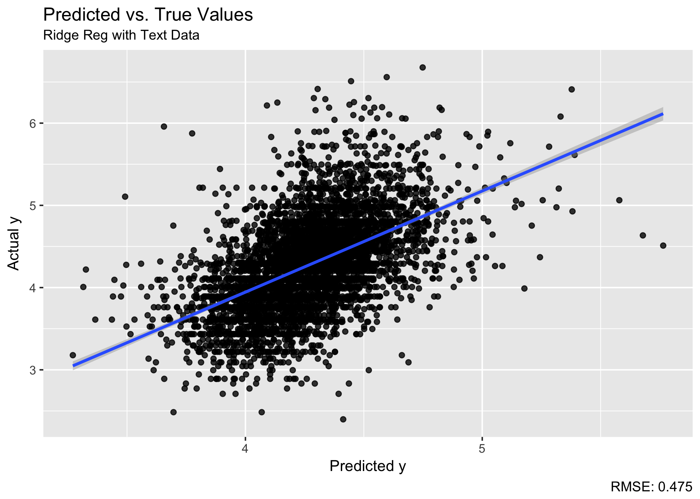
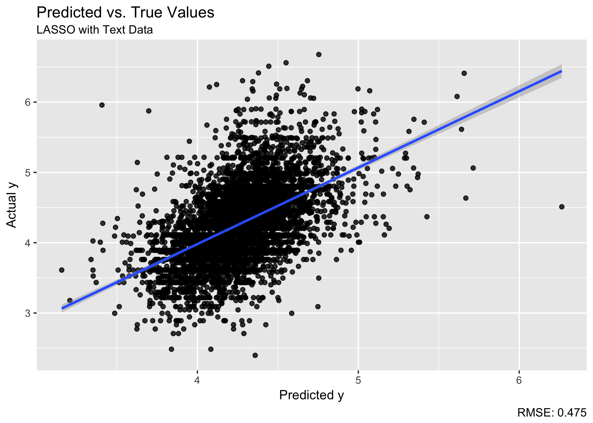

```{r message=FALSE, warning=FALSE, include=FALSE}
library(readr)
library(dplyr)
library(tidytext)
library(tm)
library(ggplot2)
library(ggridges)
require(quanteda)

rm(list=ls())
col <- RColorBrewer::brewer.pal(5, "Dark2")

options(stringsAsFactors = FALSE)
knitr::opts_chunk$set(message=FALSE, warning=FALSE)
set.seed(3456)

load(file="../output/prep2.Rda")
```


Can we improve the model from [part 2](https://franziloew.github.io/airbnb_textmining/linreg_text.html) using the description text of the listing as exogenous variables?

As before, the goal is to predict the price $y_i$ for each Airbnb listing $i$ based on some independent variables $X$. In this model the counts of the unique terms $c_i$ of each listing description are used. This is a regression problem like any other, except that the high-dimensionality of $c_i$ makes OLS and other standard techniques difficult to estimate (overfitting). 

Here, we have $d=20.637$ documents (Airbnb listings) each of which is $w$ words long. Each word is drawn from a vocabulary of $p=33.469$ possible words. The unique representation of each document has dimension $p^w$. A common strategy to deal with the high-dimensionality of text data is the estimation of penalized linear models ([Gentzkow, 2017](http://www.nber.org/papers/w23276)).

I will estimate three different models using the same training data: (1) Linear Regression (as in part 2), (2) Penalized Linear Regression using Ridge (L2 Norm) and (3) Penlalized Linear Regression using Lasso (L1 Norm). I will then use these models to make predictions on the test data to see which performs better.

## Document Term Matrix

A first step to use textdata in a prediction model is to convert it to a Document Term Matrix, where each row is a observation (document) and each column is a unique term. 

```{r}
corp <- Corpus(VectorSource(df$text_cleaned))
dtm <- DocumentTermMatrix(corp)

dtm
```

The first five observations of the Document Term Matrix look like this:

```{r}
inspect(dtm[1:5, 100:107])
```

Matrices in text analysis problems tend to be very sparse. That is, most of the elements are zero, which implies that they have many parameters that are uninformative. 

Reducing sparsity tends to have the effect of both reducing overfitting and improving the predictive abilities of the model. Here we are reducing the sparsity of the document-term matrix so that the sparsity (% of non-zeros) is a maximum of 99%.

```{r}
dtm<-removeSparseTerms(dtm,0.99)
dtm
```

```{r}
inspect(dtm[1:5, 1:7])
```

```{r}
# Convert to Dataframe
dtm.df <- as.matrix(dtm) %>%
  as.data.frame()

# Merge with orignal dataframe
dtm.df$document <-as.integer(rownames(dtm.df))
df$document <- as.integer(rownames(df))

df.reg <- dtm.df %>%
  left_join(df %>%
              select(document, price),
            by = "document") %>%
  filter(price != 0) %>%
  mutate(log_price = log(price)) %>%
  select(-document, -price)
```

## Training / Test Split

```{r}
#define % of training and test set
bound <- floor((nrow(df.reg)/4)*3)
#sample rows
df.reg <- df.reg[sample(nrow(df.reg)), ]          

# train data
df.train <- df.reg[1:bound, ]              
x.train <- as.matrix(df.train %>% select(-log_price))
y.train <- as.matrix(df.train %>% select(log_price))

# test data
df.test <- df.reg[(bound+1):nrow(df.reg), ]    
x.test <- as.matrix(df.test %>% select(-log_price))
y.test <- as.matrix(df.test %>% select(log_price))
```

## Estimation

### (1) Linear Regresion

```{r}
fit.lm <- lm(log_price~., data = df.train)

summary(fit.lm)
```

**F stats:** I can reject the null hypothesis that all of the regression coefficients are equal to zero (p-value < 0.01).

**Adjusted R-squared:** Nearly $32\%$ of the variance of the price can be explained by our model. 

**Coefficients**

The inevitable multicollinearity makes individual parameters difficult to interpret. However, it is still a good exercise to look at the most important coefficients to see if they make intuitive sense in the context of a particular application. "Most important" can be defined in a number of ways. Here, I will rank the estimated coefficients by their absolute value.

The plot below show all terms with a p-value < 0.01.

```{r fig.height=12, fig.width=6}
library(broom)

p <- tidy(fit.lm) %>%
  filter(p.value < 0.01) %>%
  filter(term != "(Intercept)") %>%
  mutate(pos = factor(ifelse(estimate>=0,1,0))) %>%
  #top_n(20,estimate) %>%
  ggplot(aes(reorder(term, estimate),estimate,
             fill = pos)) +
  geom_col(show.legend = F, alpha = 0.8) +
  coord_flip() +
  scale_fill_manual(values = c(col[1],col[2])) +
  labs(x="Estimate", y="", title ="Coefficients with p<0.01")

ggsave("../figs/coefficientslm.png", p, height = 14)
```



```{r fig.height=8, fig.width=10}
par(mfrow=c(2,2))
plot(fit.lm)
```

### (2) Ridge Regression
```{r}
library(glmnet)
```

Ridge Regression is a regularization method that tries to avoid overfitting. Like OLS, ridge attempts to minimize residual sum of squares of predictors in a given model. However, ridge regression includes an additional "shrinkage"" allowing some coefficients with minor contribution to the response to get close to zero. In a ridge regression the following term will be minimized:

$$
\text{RSS}(\beta) + \lambda \sum^p_{j=1}\beta^2_j
$$

From this we can easily see, that:

  - $\lambda = 0$: coefficients equal OLS coefficients
  
  - $\lambda = \infty$: coefficients approach zero

```{r}
#fit the model
fit.ridge <- cv.glmnet(x.train, y.train, family='gaussian', alpha=0)
```

The above code, performs 10-fold cross validation to choose the best $\lambda$. Moreover, it estimates a linear regression (family = "gaussian").

```{r}
#Results
plot(fit.ridge)
```

Minimum $\lambda$:
```{r}
lam_min <- fit.ridge$lambda.min
lam_min
```


### (3) Least Absolute Shrinkage and Selection Operator (LASSO)

Similar to the Ridge Regression, Lasso also tries to avoid overfitting. The difference is, that it uses the L1 Norm to penalize large coefficients (Lasso is aka L1 Regularization):

$$
\text{RSS}(\beta) + \lambda \sum^p_{j=1}|\beta_j|
$$

Lasso can be used to perform variable selection, as it can shrink some of the coefficients to exactly zero.

```{r}
# Fitting the model (Lasso: Alpha = 1)
fit.lasso <- cv.glmnet(x.train, y.train, family='gaussian', 
                       alpha=1)
```

The above code, performs 10-fold cross validation to choose the best $\lambda$. Moreover, it estimates a linear regression (family = "gaussian").

```{r}
#Results
plot(fit.lasso)
```

Minimum $\lambda$:
```{r}
lam_min <- fit.lasso$lambda.min
lam_min
```

## Make Predictions
```{r}
rmse <- function(error) {
  sqrt(mean(error^2))
  }
```

How well do the models perform when predicting the test data?

**Linear Regresion**

```{r}
pred.lm <- as.data.frame(predict(fit.lm, 
                newdata = df.test %>% select(-log_price)))

# Combine predictions with test dataframe
df.test$pred.lm <- pred.lm[,1]
df.test$error.lm <- df.test$log_price - df.test$pred.lm

rmse.lm <- rmse(df.test$error.lm)
print(paste0("The RMSE of the Linear Regression is: ", 
             rmse.lm))
```

**Ridge Regression**

```{r}
pred.ridge <- as.data.frame(predict(fit.ridge, x.test))

# Combine predictions with test dataframe
df.test$pred.ridge <- pred.ridge[,1]
df.test$error.ridge <- df.test$log_price - df.test$pred.ridge

rmse.ridge <- rmse(df.test$error.ridge)
print(paste0("The RMSE of the Ridge Regression is: ", 
             rmse.ridge))
```

**LASSO**

```{r}
pred.lasso <- as.data.frame(predict(fit.lasso, x.test))

# Combine predictions with test dataframe
df.test$pred.lasso <- pred.lasso[,1]
df.test$error.lasso <- df.test$log_price - df.test$pred.lasso

rmse.lasso <- rmse(df.test$error.lasso)
print(paste0("The RMSE of the LASSO is: ", 
             rmse.lasso))
```

A plot of the predicted values agains the actual values shows the explanatory power of the prediction models.  

```{r}
df.test %>% 
  select(pred.lm, pred.ridge, pred.lasso,
         log_price) %>%
  tidyr::gather(model, "predictions", pred.lm:pred.lasso) -> plot
```

```{r}
p <- df.test %>%
  ggplot(aes(pred.lm, log_price)) +
  geom_point(alpha = 0.8) +
  geom_smooth(method = lm) +
  labs(x="Predicted y", y="Actual y",
       title = "Predicted vs. True Values",
       subtitle = "OLS with Text Data",
       caption = paste0("RMSE: ", round(rmse.lm,3)))

ggsave("../figs/residplot2.png", p)
```



```{r}
p <- df.test %>%
  ggplot(aes(pred.ridge, log_price)) +
  geom_point(alpha = 0.8) +
  geom_smooth(method = lm) +
  labs(x="Predicted y", y="Actual y",
       title = "Predicted vs. True Values",
       subtitle = "Ridge Reg with Text Data",
       caption = paste0("RMSE: ", round(rmse.ridge,3)))

ggsave("../figs/residplot3.png", p)
```



```{r}
p<- df.test %>%
  ggplot(aes(pred.lasso, log_price)) +
  geom_point(alpha = 0.8) +
  geom_smooth(method = lm) +
  labs(x="Predicted y", y="Actual y",
       title = "Predicted vs. True Values",
       subtitle = "LASSO with Text Data",
       caption = paste0("RMSE: ", round(rmse.lasso,3)))

ggsave("../figs/residplot4.png", p)
```



Based on the RMSE, it can be concluded that LASSO performs best when I use the description text as exogenous variables. However, compared to the regression with structural variables from part two, LASSO performs worse. 

